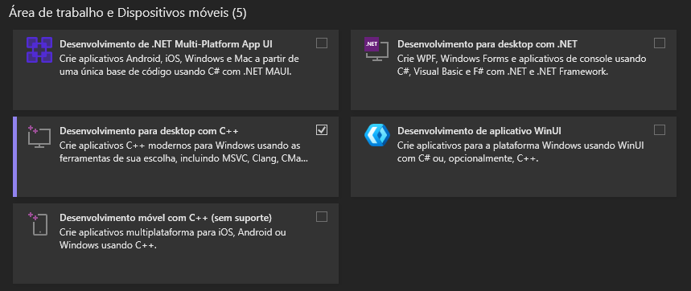

# Configuração do Ambiente

Instale e valide estes itens antes de rodar o projeto.

### Ferramentas base

#### Git

Use o Git para clonar o repositório.

* Baixe em [git-scm.com/install](https://git-scm.com/install)
* Valide com:

```bash
git --version
```

#### Flutter SDK

Use o Flutter para rodar o app.

* Siga a instalação rápida em [Flutter Quick Install](https://docs.flutter.dev/install/quick)
* Valide com:

```bash
flutter --version
flutter doctor # Para checar o funcionamento do Flutter
```

### Android

Para rodar no emulador, instale o **Android Studio**.

Siga este fluxo:

1. Instale o Android Studio em [developer.android.com/studio/install?hl=pt-br](https://developer.android.com/studio/install?hl=pt-br)
2. Abra o Android Studio
3. Aceite as licenças
4. Aguarde a IDE terminar a instalação dos componentes
5. Abra **Configurações**
6.  Vá em **Languages & Frameworks > Android SDK**<br>

    <figure><figcaption></figcaption></figure>
7. Em **SDK Platforms**, selecione a versão do Android usada no projeto
8.  Em **SDK Tools**, marque:

    * **Android SDK Build-Tools**
    * **Android SDK Command-line Tools (latest)**
    * **Android Emulator**
    * **Android SDK Platform-Tools**
    * **Android Emulator Hypervisor Driver (installer)**

    <figure><figcaption></figcaption></figure>
9. Clique em **Apply**
10. Abra o terminal e rode:

```bash
flutter doctor --android-licenses
```

11. Aceite as licenças exibidas no terminal

Valide o ambiente:

```bash
flutter doctor
```


A opção "Android Virtual Device" é essencial se você pretende testar o seu aplicativo Flutter rodando direto na tela do seu computador com Windows 11, sem precisar de um celular físico conectado.



Acesse [Set up Android development](https://docs.flutter.dev/platform-integration/android/setup) para acessar a documentação Flutter no Android.


### Windows

Para rodar como app desktop, instale o **Visual Studio**.

Durante a instalação, marque:

* **Desktop development with C++**

<figure><figcaption></figcaption></figure>

Depois valide:

```bash
flutter doctor
```


Para para mais informações, acesse a documentação do Flutter em [Set up Windows development](https://docs.flutter.dev/platform-integration/windows/setup).

