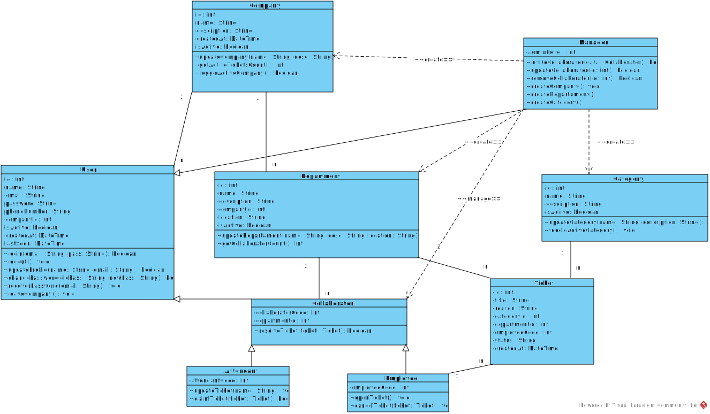

# 4.2 Diagrama de Classes (UML)

Ele mostra as classes definidas na modelagem, seus atributos, operações e associações.

<figure><figcaption>
Diagrama de classes do sistema ServFlow.
</figcaption></figure>

#### 4.2.1 Objetivo do diagrama

O objetivo deste diagrama é representar a estrutura lógica do sistema em nível de classes.

Ele permite visualizar como os elementos modelados se relacionam dentro da solução proposta.

#### 4.2.2 Elementos representados

No diagrama são apresentados:

* classes da modelagem;
* atributos definidos em cada classe;
* métodos ou responsabilidades, quando indicados;
* associações entre classes;
* multiplicidades e dependências estruturais.

#### 4.2.3 Leitura da modelagem

O diagrama deve ser usado como referência para compreender a organização interna do sistema.

Ele ajuda na interpretação das responsabilidades de cada classe e das conexões existentes entre os componentes modelados.

#### 4.2.4 Relação com os requisitos

A modelagem de classes está alinhada aos [requisitos funcionais](../2.-engenharia-de-requisitos/2.1-requisitos-funcionais.md), principalmente aos módulos de cadastro, chamados, comunicação e administração.

Ela também serve de base para as regras descritas em [3.1 Regras de Negócio](../3.-regras-e-fluxo-do-chamado/3.1-regras-de-negocio.md) e no [fluxo de chamado](../3.-regras-e-fluxo-do-chamado/3.2-fluxo-de-chamado.md).

#### 4.2.5 Observação

Os nomes, atributos e relacionamentos devem seguir exatamente o que está representado no diagrama adotado no projeto.
